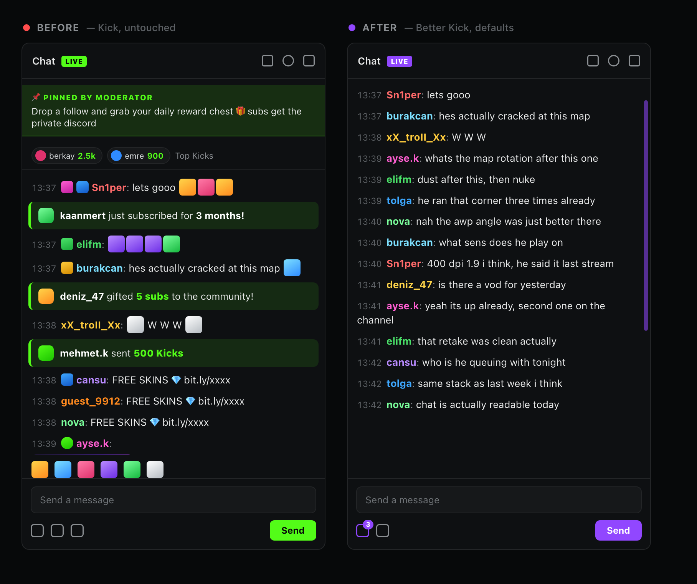
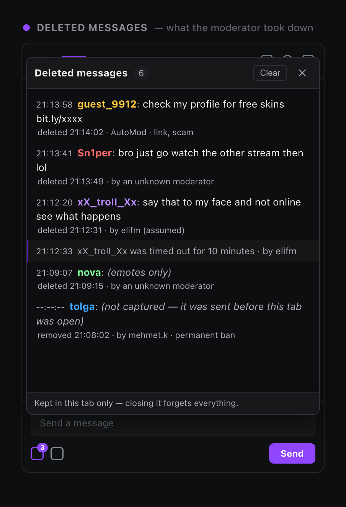
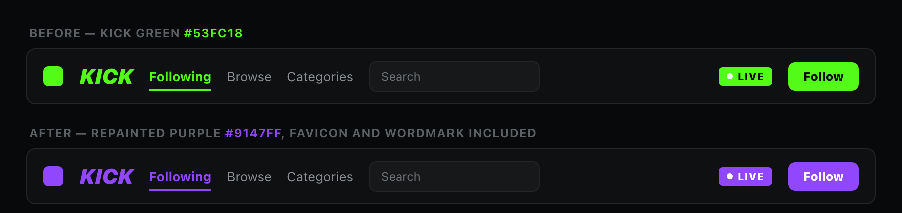
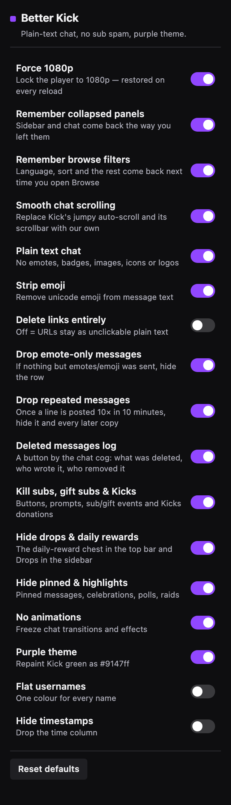

# Simple Chat for Kick

**Kick.com chat, stripped down to `username: text`.**

No emotes. No emoji. No badges. No gifs. No sub spam. No Kicks pop-ups.
Just what people actually said — plus a log of everything the moderators deleted.

---

## Before / after

The same forty seconds of the same chat, with and without the extension.

**On the left**, roughly four real sentences make it to screen. Everything else is
a pinned banner, a Kicks leaderboard, two sub events, a gift-sub event, a wall of
emotes, three copies of the same scam copypasta and a gif.

**On the right**, the same window of time — the noise never renders, so fifteen
actual messages fit instead. Nothing is summarised or rewritten: emotes,
badges, images and events are simply not there, and the text is untouched.

> [!NOTE]
> These panels are faithful mock-ups rendered from the extension's own
> stylesheet, not screenshots of a live channel — Kick chat is a live stream of
> other people's messages, and a real capture would put strangers' names and
> words in a README permanently. The sources are in [`docs/mockups/`](docs/mockups)
> if you want to re-render them.

---

## What you get

|  | |
|---|---|
| 🧹 **Just chat** | Chat is `username: message` and nothing else — no badges, emotes, emoji, gifs or images. Deleted messages stay visible, highlighted; click a name to see that person's history. |
| 🔇 **No subs, gift subs or Kicks** | Sub buttons, upsells, "X gifted 5 subs", "Y sent 500 Kicks", the top-gifter marquee, the recent-Kicks pill bar. |
| 🗑️ **Deleted-message log** | Every message a moderator removed, kept and readable — who wrote it, what it said, who took it down and why. |
| 📌 **No pinned, polls or raids** | Pinned messages, celebrations, confetti, announcements, predictions. |
| 🟣 **Purple theme** | Kick's `#53FC18` becomes `#9147FF` — wordmark and browser-tab favicon included. |
| 🎞️ **Locked to 1080p** | The player stays at 1080p across reloads, channel changes and stream restarts. |
| 🪄 **Smooth chat scrolling** | Kick's auto-scroll is replaced with one that can't drift, plus a slim overlay scrollbar. |
| 💾 **Remembers your layout** | Collapsed sidebar, collapsed chat and your Browse filters all come back the way you left them. |

Everything above is a toggle, and every toggle applies live.

---

## The deleted-messages log

A moderator removes a line and it's gone — Kick never tells the page what it
said. So the extension catches the message **before** it is deleted: it keeps a
small rolling cache of everything that came down the WebSocket and pairs it
with the deletion event when that arrives.

A trash-can button sits in the chat footer next to the settings cog, with a
badge counting what you haven't looked at. Clicking it opens the window above.

It is careful about **who** it names, because Kick's own events are:

- A plain delete event carries no moderator, so the entry says
  *"by an unknown moderator"* rather than inventing one.
- A **ban** event does name one, so the moderator, the punishment and the
  messages it swept are all logged as fact.
- When a ban lands within 15 seconds of an unattributed delete of the same
  user, that name is backfilled and marked **(assumed)** — an attribution, not
  a claim. Never onto an AutoMod removal, which already says who did it.
- A message sent before you opened the tab reads *"(not captured)"* instead of
  being guessed at.

The log is per tab and per channel. Switching channels clears it, closing the
tab forgets it, and nothing is ever written to disk or sent anywhere.

---

## Purple theme

Three mechanisms, because Kick's green lives in three places a stylesheet can't
all reach: design tokens are overridden by CSS, anything still computing green
at runtime is repainted (gradients, shadows and `::before` dots included), and
the wordmark and favicon — separate files no stylesheet of ours can touch — are
fetched, recoloured and handed back as `data:` URIs.

The theme recolours accents only. It does not repaint the chat background.

---

## Install

No Web Store listing — load it unpacked:

1. Download the latest [`better-kick-1.0.0.zip`](https://github.com/firatmelih/better-kick-chrome-extension/releases/latest) and unzip it
   (or `git clone` this repo).
2. Open `chrome://extensions`.
3. Turn on **Developer mode**, top right.
4. Click **Load unpacked** and pick the folder.
5. Open any `kick.com` page.

Works in Chrome, Edge, Brave and Opera — anything Chromium with Manifest V3.
The only permission it asks for is `storage`, for your toggles. It talks to no
server and collects nothing.

---

## Options

Click the extension icon. Every toggle applies live — no reload.

| Option | Default | |
|---|---|---|
| Simple chat | on | Just `username: text` — no badges, emotes, emoji or images. Also hides subs, gift subs, Kicks, pinned messages, polls, raids, drops and daily rewards, and freezes chat animations |
| Show deleted messages | on | Deleted messages stay in chat, highlighted, and the log button by the chat cog shows who wrote and removed them. Off: they disappear as on Kick |
| Remember settings | on | Player locked to 1080p; collapsed sidebar and chat, and Browse filters, come back the way you left them |
| Purple theme | on | Repaints Kick green as `#9147FF`, favicon included |

Every toggle applies live, no reload needed.

 

---

## Troubleshooting

Open the console on a `kick.com` tab and type:

| | |
|---|---|
| `__bpkDiag()` | Start here. Prints which scripts loaded, every `data-bpk-*` flag, the browse memory, and a table of everything still painted green. |
| `__bpkScroll.report()` | What the scroll takeover thinks is happening. `deadSpace` is the giveaway for a stale height model. |
| `__bpkScroll.off()` | Hands the scroller back to Kick without touching your settings — an A/B on a live chat. |
| `__bpkQuality.report()` | What quality is pinned and how often it had to be re-applied. |
| `__bpkBrowse.report()` | What browse filters are remembered. `__bpkBrowse.forget()` wipes them. |

If something you *wanted* disappeared, it's almost always the sub/gift hiding
in *Simple chat* — those selectors match on substrings like `gift`, which is the
price of catching sub UI that gets renamed every few months.

---

# Under the hood

Everything below is the detailed version: what each feature actually does, why
it's built the way it is, and which parts of Kick's DOM it depends on.

## What it does, in detail

**Just chat draws its own list.** With *Just chat* on, Kick's message list
is covered by one the extension draws itself (`src/justchat.js`): each line
is the username, a colon and the message as plain text. Emotes, emoji, gifs
and stickers are taken out of the text; a message that was nothing but those
isn't shown at all. Links stay as plain, unclickable text. Deleted messages
and banned users' messages stay where they were, tinted red and tagged
*deleted*. Click a username to see everything that person has said on the
channel since the page opened, deleted messages included.

This is what ended the flicker. Every earlier version edited Kick's own rows
— hiding badges, stripping emoji, collapsing emote-only lines — and Kick's
list is virtualised off measured row heights, so each edit changed a height
it had already measured and it re-laid itself out. The new list is fed from
the same data Kick uses (the chat-history request, read from a clone of the
response, plus the live WebSocket frames) and Kick's rows are never touched;
they're hidden with `visibility`, so Kick's layout doesn't change either.

**Sub and pinned events are stopped at the socket, not hidden in the page.** Kick's
message list is virtualised off remembered row heights, and it cannot
recalculate around a row that vanishes underneath it: its height model stops
matching the DOM, every scroll position it computes from that model is wrong,
so it aims past the real end, decides it isn't at the bottom, renders the
wrong window of rows, repositions them, and repeats. Hiding a row *better*
doesn't help — the list is the thing doing the moving.

So the messages never reach it. Chat arrives over a WebSocket, and
`src/chatfilter.js` intercepts those frames in the page world before Kick's
own code is handed them: sub/gift/Kicks/pinned events are dropped there. Kick never learns they
existed, renders no row, and its model stays exactly right. Nothing to hide,
nothing to recalculate, nothing to flicker.

It fails **open** by design — anything unparsed, unrecognised or unexpected is
delivered untouched, and Pusher's own protocol frames are excluded before any
matching happens (`pusher_internal:subscription_succeeded` contains the word
"subscription"; swallowing it wouldn't hide sub messages, it would kill the
chat). A bug in there costs a filtered message, never a working chat.

**The DOM rules are still the safety net** — the first screenful of history
arrives over HTTP rather than the socket, and anything the filter doesn't
recognise has to be caught somewhere. Two rules govern that, both about the
same virtualised list:

- **Never `display: none`.** The list measures each row and remembers the
  height. A `display: none` row has no box and no `offsetParent`, so it can't
  be measured — the list keeps the height it remembers for a row that now
  occupies nothing, and from that moment its model and the DOM disagree.
  Every scroll position it computes off that model is wrong: it aims past the
  real end, decides it isn't at the bottom, renders the wrong window of rows,
  repositions them, and repeats. Dropped rows are collapsed to **zero height**
  instead (`kick.css` section 10) — same visual result, no gap, nothing
  painted, but the row keeps its box, so a fresh measurement reads 0 and the
  list gets to be right.
- **Judge the row before it paints.** All the other work in `content.js` is
  deferred to `requestAnimationFrame`; row tagging is not. A MutationObserver
  callback is a microtask — after the DOM changed, before the frame's layout
  and paint — so a row tagged there never appears at all. Deferring it by one
  frame means every dropped message flashes at full height first, *and* hands
  the list a full-height measurement of a row that's about to be zero.

A row's very first tagging applies instantly; a row that already painted only
re-collapses once its new verdict has held steady for ~220ms. Kick's own
re-renders churn row attributes constantly, and without that debounce a badge
briefly vanishing mid-render reads as "message just went empty" and flaps the
collapse on and off.

**Chat scrolling is taken over completely.** Dropping rows is exactly what
Kick's virtualised list can't cope with: it remembers each row's height, so
the moment a row is collapsed its idea of "the bottom" no longer matches the
DOM. Its auto-scroll then aims at a position that doesn't exist, misses,
concludes it isn't at the bottom, and fights itself — the jumping and the
stuck "N new messages" chip. So the extension takes the scroller away from
it: Kick's scroll-to-bottom calls are swallowed and the follow logic is
re-done against a measurement that can't be wrong — the on-screen bottom edge
of the last row that is actually rendered. Kick's native scrollbar is hidden
and replaced with a slim overlay one that fades in while you're in chat and
can be dragged. Scrolling up pauses following, as usual; the "N new messages"
chip still works (its click is caught and performed by us).

**Deleted messages are kept and readable.** A trash-can button sits in the
chat footer next to Kick's settings cog, left of *Send*, with a badge counting
what you haven't looked at. Clicking it opens a chat-shaped window over the
message list: every message a moderator removed, who wrote it, what it said,
when it went, why, and — where Kick's events say so — who took it down.

It works because the message is caught **before** it is deleted. Once a
moderator removes a line it is gone from the DOM and Kick never tells the page
what it was, so `src/chatlog.js` keeps a small rolling cache of everything that
came down the WebSocket (the same frames `chatfilter.js` already reads — one
socket patch, one place) and pairs it with the deletion event when that
arrives. Messages the extension itself filtered out are cached too, so a
deleted emote-only line is still recoverable.

What Kick's own events do and don't say, and therefore what the window can
honestly claim:

- `MessageDeletedEvent` carries the message id and, when Kick's
  auto-moderation did it, an AI flag and the rules that were violated. It does
  **not** name a moderator, so the entry reads *"by an unknown moderator"*
  rather than inventing one.
- `UserBannedEvent` **does** name one (`banned_by`), and a ban also takes the
  user's messages off screen — so a ban logs the moderator, the punishment
  (permanent, or the timeout's length) and the messages it swept, all as fact.
- A moderator who deletes a message and then bans its author does both in one
  action, seconds apart. When a ban lands within 15s of an unattributed delete
  by the same user, that name is backfilled onto it and marked **(assumed)**,
  with the reasoning in the row's tooltip. Never onto an AutoMod removal —
  that one already says who did it, and it wasn't them.

The log is per tab and per channel: switching channels clears it (one chat's
deletions are not another's), closing the tab forgets it, and nothing is ever
written to disk or sent anywhere. It holds the last 400 entries. *Clear* empties
it on the spot.

**Finding the footer** is its own problem: it has no id, its buttons are
icon-only, their labels are localised, and the send button isn't reliably a
`button[type="submit"]`. So the mount doesn't look for the send button at all
— it works outward from the one thing in that footer that's unmistakable, the
box you type in, climbs to the nearest row that holds a real button, and goes
in left of the settings cog (or left of the last button, if the cog can't be
told apart). The quick-emote strip is explicitly skipped, since plain-chat
mode hides that whole row. If there's no composer at all — logged out, or a
read-only chat — the button floats at the chat panel's top-right instead: a
feature you can't reach is worse than one sitting slightly off. Which route
was taken is written to `<html data-bpk-logmount>` (`cog`, `send`, `float`, or
`none` for "no chat panel here"), printed by `__bpkDiag()` and logged once to
the console.

Two implementation notes, both the same lesson the rest of this extension
learned the hard way. The window is `position: fixed` at `<body>` level over
the chat's rect rather than a child of the chat, because React reconciles
foreign children out of that subtree — the same reason the custom scrollbar
lives there. The *button* has to be in the footer to sit next to the cog, so
it is simply remounted whenever React drops it. And nothing in an entry is
ever treated as markup: the page world can forge a `postMessage`, so every
field goes into the DOM through `textContent`.

**Subs, gift subs and Kicks disappear.** Subscribe buttons, gift-sub buttons,
sub upsells, sub-only prompts, the "X gifted 5 subs" / "Y just subscribed"
event lines in chat, plus Kicks (donation) UI: the recent-senders pill bar
above chat, send-Kicks buttons, and "sent N Kicks" event rows.

Two of these hide by exact `data-testid` rather than by word, because the
obvious hooks aren't there. The subscribe button is `data-testid="sub-button"`
— the string "subscribe" appears nowhere on it, and its only text is localised
("Abone Ol" on a Turkish account), so both the `[*="subscribe"]` rules and the
English label matching in `content.js` walked straight past it. The gift-sub
leaderboard (the scrolling "top gifter" marquee above chat) says "gift" only
in an image path and an `alt`, so it's matched on
`button[aria-label*="leaderboard"]`, `[class*="leaderboard"]` and
`img[src*="/gift-ranks/"]`, with a `:has()` rule to take the two wrappers that
would otherwise stay behind as an empty 33px strip. The channel-points button
(`data-testid="channel-points-button"`) rides the drops toggle — same family,
a passive accrual counter.

**The player is locked to 1080p.** Kick remembers the chosen quality in
`sessionStorage.stream_quality`, which is per tab and gets wiped or reset to
"Auto" on a reload, a channel change or a stream restart — so the preference
is always gone by the time the player reads it. `quality.js` runs in the page
world before Kick's bundle boots, keeps the real preference in `localStorage`
(which does survive reloads, tabs and restarts), copies it into
`sessionStorage` in time for the player to read, and holds it there: any later
write that would lower it is replaced with 1080 instead of being stored, and
deletes are ignored. It learns the exact spelling Kick uses (`1080`, `1080p`,
`1080p60`) from Kick's own writes rather than guessing one.

As a fallback for streams that start below 1080 anyway, the extension also
checks the stream's actual resolution (`video.videoHeight`) every few seconds;
if it's low it walks the player's settings menu and clicks the 1080p option
itself. The menu is kept invisible while that happens, so nothing flashes. If
a stream simply has no 1080p option, it gives up on that stream instead of
retrying forever.

`__bpkQuality.report()` in the page console shows what is pinned and how often
it had to be re-applied; `__bpkQuality.pin('720p60')` locks a different rung.

**Collapsed panels are remembered.** Kick holds the collapsed state of the
left rail and the chat panel in React state and nowhere else, so every reload
puts both back to their defaults. Nothing outside the app can set that state —
the only way in is the toggle you click — which makes replaying a click the
only mechanism available.

Which button to replay is **learned, not hardcoded**, because neither toggle
has a hook worth trusting: a collapse button's `aria-label` flips between
"collapse" and "expand" as you use it, and the labels are localised on top of
that. So when a click is followed by a panel changing width by more than 40px,
that button is the toggle for that panel; it's stored along with the width you
left the panel at, and on the next load, if the panel comes up materially
different, the button is clicked once. Collapsing a panel is therefore also
what teaches it — there's nothing to configure, but a panel isn't remembered
until the first time you toggle it.

Some details that matter:

- **The panels are found geometrically**, not by name — the left rail is the
  tall element pinned to the left edge, whatever Kick calls it this month. It
  stays full height when collapsed, so this finds it in either state.
- **An absent panel counts as zero width.** A collapsed chat panel is usually
  unmounted rather than shrunk, and both need to read the same way.
- **The toggle's presence is what says "this page has this panel"**, not the
  panel's. Testing for the panel can't work: the state most in need of
  restoring is the one where it's unmounted and there's nothing to find.
- **Only stable hooks are learned** (`data-testid`, `id`, `aria-label`,
  `title`). A structural path would be brittle in a way that stays invisible
  until it silently clicks the wrong thing, so a button without one of those
  is simply not learned.
- **Nothing that navigates is ever learned or replayed.** A collapse toggle
  never changes the URL; a link always does. This is the feature's sharpest
  edge and it drew blood once: clicking a stream from the browse grid takes
  the chat panel from 0 to full width, which reads as a textbook
  collapse-toggle signal, so the first version learned the *stream card* as
  the chat toggle — and then dutifully "restored" the chat panel by navigating
  back to that stream every time you opened Browse. Three guards now: links
  are skipped at learn time, a width change measured across a navigation is
  discarded because the two snapshots are of different layouts, and at restore
  time a stored signature that has come to resolve to a link is dropped rather
  than clicked. If a click does navigate anyway, that entry is forgotten
  immediately — otherwise it would repeat on every page load. The store
  carries a version stamp so anything learned by the older logic is discarded
  on sight.
- **Two strikes before a memory is dropped.** If the click stops working the
  entry is forgotten, but one failure is more likely a page that happens to
  have a same-named button than a genuinely stale hook.
- Restoring stops after two clicks or 15 seconds, whichever comes first, so it
  can never undo a toggle you made yourself.

**Browse filters are remembered.** Kick keeps the browse filters in the query
string (`/browse?language=armenian&sort=viewers_high_to_low`), so a refresh
holds them — but the *Browse* link in the nav points at a bare `/browse`, so
coming back from a stream throws the whole selection away. `browse.js` stores
whatever query string the page settles on and puts it back on the way in.

Two restore paths, because there are two ways into the page. On a hard load
(refresh, pasted link, new tab) it rewrites the URL with `replaceState` at
`document_start`, before Kick's bundle boots — so the first paint is already
filtered, at no extra request. On an in-app click of a bare browse link it
cancels the SPA navigation and goes to the remembered URL instead: one
navigation, and the address bar can never claim filters the page isn't
applying. A `router.push` that never involves a link is caught by a slow poll
and costs a reload, which is why it's the last resort.

It stores the query string as-is and never parses it, so it keeps working if
Kick renames `sort` or adds a filter — nothing in there knows what "armenian"
means. The memory is keyed on the **exact path**, one entry per page. Grouping
whole sections under one key was the first version's bug and it broke the
feature twice over: sibling tabs (`/browse`, `/categories`, `/clips`)
overwrote each other's filters, and a click from one tab to another looked
like a click to the page you're already on — which is the single case restore
is suppressed for, since it means you're deliberately resetting. Filters are
also saved the moment the page loads rather than on the next poll, so picking
a filter set and immediately clicking away no longer loses it.

Clearing the filters while you're on the page is remembered
too: an empty query is only recorded when you were already there, so arriving
on a bare URL can't erase what's about to be restored. `__bpkBrowse.report()`
shows what's stored; `__bpkBrowse.forget()` wipes it.

**Drops and the daily-reward chest disappear.** The chest button in the top
bar that claims a daily reward, and the *Drops* entry in the left sidebar —
the sidebar row's wrapper goes with it, so there's no gap left in the nav.
The chest is icon-only, so its `aria-label` is the only text it has and that
label is localised: both the English and the Turkish wording ("Günlük Ödülünü
Al") are matched.

**Quick emotes go with plain-text chat.** Kick's one-click emote strip above
the chat box (`#quick-emotes-holder`) is hidden along with the emote and gif
pickers, and so is the flex column it sits alone in — that column keeps its
own bottom padding otherwise and stays behind as a thin bar.

**Pinned and hyped stuff disappears.** Pinned messages, highlighted messages,
celebrations, confetti, announcements, raids, polls and predictions.

**No animations** in the chat area.

**Purple theme.** Kick's `#53FC18` green becomes `#9147FF` — including the tab
favicon. The icon is a separate file the page's CSS can't reach, and unlike
the wordmark it isn't necessarily an SVG, so there are two routes: an SVG
favicon reuses the wordmark's text rewrite and stays vector-sharp, while an
`.ico` or `.png` is fetched, drawn to a canvas, recoloured pixel by pixel and
handed back as a data URI. Same origin, so the canvas is never tainted and
`getImageData` is allowed.

The pixel test is deliberately looser than the one used for CSS values: there,
the colour is exactly what a designer wrote; in a bitmap every edge pixel is a
blend between the brand green and whatever sits behind it, and leaving those
alone puts a green fringe around a purple icon. Transparent pixels are skipped
and alpha is preserved, so antialiasing survives. If nothing in the file is
green, Kick's own icon is left alone rather than being replaced with a copy.

The `<link>` element's `href` is updated in place rather than the node being
swapped out — Chrome re-reads a changed `href`, and leaving Next.js's own head
nodes where they are keeps this clear of its head manager. A `MutationObserver`
on `<head>` catches Kick rewriting the icon on navigation; the write is skipped
when the href already matches, so that observer can't feed itself.
This works two ways: a stylesheet overrides Kick's design tokens, and a runtime
pass reads computed styles and repaints anything still coming out green —
including gradients and shadows — so it holds up when Kick ships new class
names. The theme recolours accents only; it does not repaint the chat panel's
background.

The Kick wordmark is repainted too, and it needs a third mechanism: the logo
is an `` pointing at `/img/kick-logo.svg`, so its green lives inside a
separate document that no stylesheet of ours can reach and the computed-style
pass can't see. The file is fetched once (same origin, straight out of the
HTTP cache), its greens are rewritten to `#9147FF`, and the result goes back
on the element as a `data:` URI. A logo drawn with `currentColor` instead of a
literal green has every shape forced purple — but only for a file whose name
actually says `kick-logo`, so a sponsor logo is never repainted wholesale. The
original `src` is kept on the element, so switching the theme off puts the
green wordmark straight back without a reload.

## How it works

`src/kick.css` does essentially all the hiding, gated on `data-bpk-*`
attributes that the content script writes to `<html>`. `src/content.js` only
does what CSS can't:

- tag chat rows and containers so the CSS has a stable hook
- hide sub/gift and drops controls that are only identifiable by their label
  text, and collapse the sidebar wrapper a hidden entry leaves behind
- fetch the Kick wordmark's SVG and hand it back recoloured
- mount the deleted-messages button in the chat footer and draw its window
  from what `chatlog.js` posts over
- repaint green computed colours to purple

Hiding is done with CSS rather than by deleting nodes on purpose: Kick's chat
is a virtualised React list that recycles DOM nodes, and node surgery there
both fights the framework and can leave the wrong rows hidden after a recycle.
Stateless selectors survive it.

`src/quality.js`, `src/browse.js`, `src/chatlog.js`, `src/chatfilter.js`,
`src/chatscroll.js` and `src/diag.js` are the odd ones out: all six are
declared with `"world": "MAIN"`,
so they run in the *page's* JS context rather than the extension's isolated
one. That isn't a preference — an isolated-world script gets its own
`Storage.prototype`, its own `history`, and its own JS wrappers for DOM nodes,
so patching any of them there would only ever intercept our own calls, never
Kick's. That rules out all four jobs: pinning `stream_quality`, seeing the
SPA's `pushState`, taking the chat scroller away from the virtual list, and
patching `WebSocket` to read chat before Kick does — which is what both the
message filter and the deleted-message log are built on.
Each reads its on/off state from an `<html data-bpk-*>` attribute, since the
two worlds share the DOM and nothing else.

What `chatscroll.js` does, in order:

- finds the chat scroller by walking out from `#chatroom-messages`
- redefines `scrollTop` / `scrollTo` / `scrollBy` / `scrollIntoView` on it:
  while chat is following the bottom, page-side scroll writes are
  *redirected* to the position we measured, not swallowed — a virtual list
  whose scroll request never happens keeps retrying and re-rendering its rows
  each time, and that fight is visible as twitching even when the final
  position is right. While you're scrolled up reading, only *downward* writes
  are dropped, so Kick can still correct the position when it trims old
  messages off the top.
- pins to the bottom itself, computed as "the scrollTop at which the last row
  that actually has client rects sits flush with the bottom edge" — a
  `display:none` row reports no rects, which is precisely the thing Kick's
  remembered heights get wrong
- applies that correction synchronously in the MutationObserver callback, so
  it lands before the frame's layout and paint. Deferring to `rAF` paints the
  collapsed row once at its old offset first, which is a one-frame jump.
- follows **instantly**, never eased. An eased catch-up spends several frames
  at positions the list considers wrong and it re-renders at each of them.
  Smoothness is for scrolling you asked for: the wheel, the thumb, and the
  jump-to-bottom.
- draws the replacement scrollbar as a `position: fixed` overlay at `<body>`
  level, tracking the scroller's rect. It's deliberately not a child of the
  chat: React owns that subtree and would reconcile a foreign node away.
  It's shown for pointer input only — flashing it on every incoming message
  is its own kind of flicker.

Browser scroll anchoring is deliberately left **on**: while you're scrolled
up, it's the thing that keeps the view still when a row above the viewport is
collapsed 220ms after painting.

`__bpkFilter.report()` shows what the socket filter is doing — how many
frames it has seen and how many it dropped. `frames: 0` means the socket
isn't being intercepted at all; a high frame count with `dropped: 0` means
Kick's event names have changed, and `__bpkFilter.spy()` logs every frame's
event name and payload so they can be corrected.

`__bpkLog.report()` does the same for the deleted-message log: whether it is
recording, how many messages are cached and how many deletions it has logged.
`__bpkLog.list()` dumps the entries as data. The two halves fail separately —
no recorder means `chatlog.js` never ran, a recorder with no button means
`content.js` couldn't find the chat footer to mount it in — and `__bpkDiag()`
prints both.

On a live channel, `__bpkScroll.report()` in the page console dumps what it
thinks is going on — which element it took over, our bottom vs the native
one (`deadSpace` is the giveaway for a stale height model), how many rows are
currently hidden, and how many corrections it's had to make.
`__bpkScroll.off()` hands the scroller back without touching settings, for
an A/B on a live chat.

`__bpkDiag()` (from `src/diag.js`) is the one to reach for first on any "it
didn't work" report: it prints the current URL, which of the page-world
scripts loaded, every `data-bpk-*` flag, the browse memory and the trail of
URLs it has seen, and a table of every element still painted brand green —
each with the property, the computed value, and whether an inline style was
ever written to it. Green with no inline style means the repaint pass never
reached that element; green *with* one means something later overrode it.
It lives in the page world because that's the console you get on kick.com —
anything `content.js` exposes is in the isolated world and can't be typed at.

Two things about the repaint pass that are easy to get wrong, both of which
were once bugs here:

- **The pass has to be reversible.** It used to only ever *add* inline styles,
  which is fine while an element's colours are fixed and wrong the moment they
  are not. Kick's browse tabs move the "active" classes from one `<a>` to the
  next, so a tab that had just gone inactive kept the purple written for it and
  carried on looking active — two tabs underlined at once. `repaint()` now
  records which properties it wrote per element and takes them back off before
  re-measuring. The order matters: clearing has to happen *before*
  `getComputedStyle`, or the read returns our own purple and the element looks
  like it was never green. The same bookkeeping makes turning the theme off
  work without a reload.
- **Elements are re-checked, not checked once.** Colours aren't settled the
  first time an element is seen — React restyles, a stylesheet lands late, a
  browse card hydrates into its live state — so a one-shot check left LIVE
  pills and buttons green forever. `paintGen` records the sweep generation an
  element was last examined in; the 4s sweep bumps the counter (only when the
  tab is visible) and the budgeted queue works through everything again.
- **`::before` / `::after` need a different mechanism.** They take no inline
  style, and `getComputedStyle(el)` doesn't report them, so the repaint pass
  was blind to them — and the dot on a LIVE pill is exactly that. `repaint()`
  reads them with the pseudo argument and, when it finds green, tags the host
  with `bpk-pb-*` / `bpk-pa-*`; `kick.css` does the recolouring through those
  classes.
- **Not every green is a colour property.** The verified badge is an `<svg>`
  whose `<path>` is filled with `url(#VerifiedBadge__a)` — computed `fill` is
  that URL, never a colour, and the actual green (`#1EFF00` → `#00FF8C`) lives
  in `<stop stop-color>` inside a `<linearGradient>`. `stop-color` is now in
  `COLOR_PROPS`, and because `<stop>` sits inside a `<defs>` that the UA
  stylesheet hides, the attribute is read directly as well rather than relying
  on the engine resolving presentation attributes in an unrendered subtree.
  That is also why the green test parses hex: computed styles are always
  `rgb()`, but SVG presentation attributes never go through the cascade.

Two details worth knowing if you edit this:

- The observer does **not** watch the `style` attribute. `repaint()` writes
  inline styles, so watching them would feed our own writes back in as a loop.
- The animation rules deliberately leave `transform` alone — virtualised chat
  lists position rows with `translateY()`, and clearing it collapses the list.

## Current Kick DOM (2025+)

Kick's chat was rebuilt on Tailwind with a virtualised list, and almost nothing
carries a telling class name anymore. The extension keys on what that DOM does
expose:

- rows are `[data-index]` wrappers whose body has an inline
  `font-size: var(--chatroom-font-size)` style
- badges are `div[data-testid="identity-badge-*"]` wrappers around an `<svg>`,
  with their box size in a `size-[...]` utility class — the wrapper is hidden,
  not just the svg, or its reserved box stays behind as a gap
- the username is a classless `<button data-prevent-expand>` carrying the chat
  colour inline
- the `:` separator span is `aria-hidden="true"` (visible on screen, hidden
  from screen readers), which is why `aria-hidden` is *not* treated as
  invisible text
- the timestamp span is recognised by its inline
  `--chatroom-timestamps-display` style variable

A `data-index` change (the virtual list recycling a row into a different
message) triggers re-evaluation of that row. The plain-chat hide rules also
exist in a second, JS-free form scoped to `#chatroom-messages` and the
`--chatroom-font-size` rows, so images/badges stay hidden even if row tagging
ever misses.

## Notes on the matching

Chat-row detection is intentionally loose (several selector families, plus a
"outermost element holding at most one username" rule) so it survives Kick
renaming classes. Two consequences:

- A row is only treated as a sub/gift *event* if it has no username element, so
  a viewer typing "subscribe to my youtube" keeps their message.
- "Nothing was said" is judged on text that isn't the username, the timestamp
  or a hidden decoration. Punctuation counts as text, so `!!!`, `:)` and `w`
  are all kept — only genuinely blank rows go. If the username element isn't
  one the extension recognises, it falls back to spotting a row that renders
  as a single bare token plus a colon. The trailing colon is required, so a
  one-word system notice like "Reconnecting" is not mistaken for a stranded
  username.
- Decoration is collapsed structurally: the outermost element in a row that
  renders no text is hidden, wrapper included. Hiding only the inner ``
  is what left badge-shaped gaps before. Spans holding only whitespace are
  kept, since those are real spacers between the name and the message.
- Screen-reader-only text (`sr-only`, `visually-hidden`, `aria-hidden`, svg
  `<title>`) is not counted as text anywhere. A badge is typically
  `Moderator`, and that
  invisible label is why badge wrappers used to survive as blank gaps and why
  badge-only rows looked like they had something to say.
- Drops are matched on the element's *whole* label, not a substring, so a
  channel or a message called "drops" is never touched — and `drop` on its own
  is deliberately not matched, since `[data-testid*="drop"]` would take every
  dropdown on the site with it. The sidebar wrapper is only collapsed while
  the hidden entry is its parent's only child, so a whole nav section can't go
  down with one item.
- The sub/gift selectors match on substrings like `gift`, so unrelated UI with
  `gift` in its class name would also be hidden. That's the tradeoff for
  catching sub UI that gets renamed; turn off *Kill subs & gift subs* if it
  ever hides something you want.
